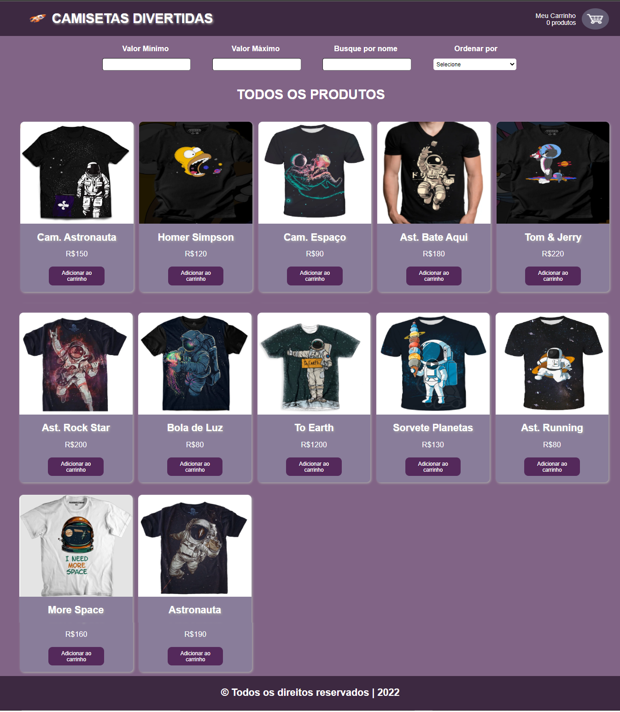
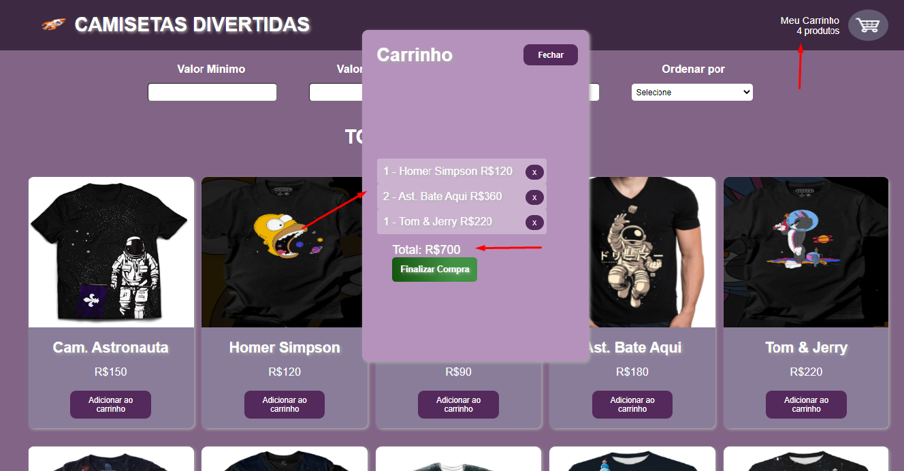

<h1 align="center">
     
    
🚀 Projeto Labe-commerce

</h1>

## 🎨 Layout

 

O projeto é um e-commerce que vende camisetas com estampas divertidas relacionadas ao espaço;

 

 

<h1>
     
    
🧠 Contexto

</h1>

O objetivo foi criar uma landing Page de uma empresa de tênis voltado para o conforto de quem trabalha em escritório.

- Link do projeto do SURGE
- Tecnologias Utilizadas
- Requisitos
- Colaboradores!

 

<h1>
     
    
🔗 Link do projeto no Surge

</h1>

https://perpetual-sound.surge.sh

<h2>
     
    
🔗 Link do Figma

</h2>

https://www.figma.com/file/NzeinRPZOCguqI2vFNyezi/Untitled?node-id=0%3A1

 

<h1>
     
    
🛠️ Tecnologias Utilizadas

</h1>

 
 
 
  
  
  
  
 

 

<h1>
     
    
⚙️ Requisitos

</h1>

O projeto consistirá em 3 grandes partes:

- Home
  - Mostrando todos os produtos
  - Deve haver alguma forma de ordenar os produtos por ordem crescente ou decrescente de preço (pode ser na home em si ou junto dos filtros)
  - Produtos:
    - Devem ter um botão que permita adicioná-los ao carrinho
    - Devem exibir o nome, preço e imagem em um card
- Carrinho
  - Mostrar todos os produtos e quantidades adicionadas
  - Capacidade de remover itens do carrinho
  - Mostrar o valor total do carrinho
- Filtro
  - Por valor mínimo e máximo
  - Por nome do produto

 

<h1>
     
    
👨‍💻 Contribuidores

</h1>

_Qualquer dúvida ou sugestão, chama no contatinho!_

<table>
  <tr>
    <td align="center"><a href="https://github.com/Xoxo31"> <b>Ana Lívia Cruz</b></a> <a target="_blank" href="">LinkedIn</a> </td> 
     <td align="center"><a href="https://github.com/elisabetealves"> <b>Elisabete Alves</b></a> <a target="_blank" href="https://www.linkedin.com/mwlite/in/elisabete-alves-675637135">LinkedIn</a> </td>    
    <td align="center"><a href="https://github.com/Rafael563"> <b>Rafael Santos da silva</b></a> <a target="_blank" href="">LinkedIn</a> </td>    
  </tr>
  
</table>

 

### Feito com ❤️ e muita dedicação
